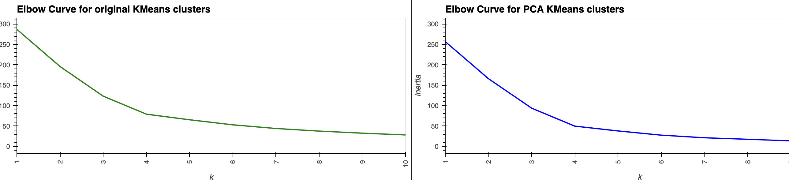
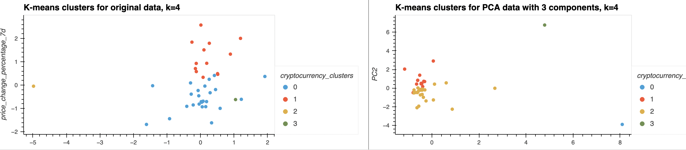

# Cryptoclustering

---

This Jupyter notebook application uses unsupervised K-means clustering and principal component analysis (PCA) to identify investment opportunities among 41 cryptocurrencies. Percentage price change in time periods from 24h to 1 year are the input features. K-means clusterings are optimized by comparing K values from 1 to 11 using an elbow curve. Visualizations are created with the PyViz hvplot. 

## *Technologies*
This application is written using Python 3.9.7 and uses pricing data for different time periods for 41 cryptocurrencies. Interactive line plots and visualizations are created using the PyViz hvplot.

## *Installation Guide*
Install the pandas, and hvplot libraries, Path from the pathlib library, and KMeans, PCA and StandardScaler from the sklearn library.

## *Usage*
Run the program from the command line as 'crypto_investments.py'.

## *Contributors*
This program was written by David Hockenbery with the assistance of the UW FinTech class of 2021 and instructors. Contact David at dhockenb@gmail.com.

## *License*
opyright (c) [2022] [David Hockenbery]

Permission is hereby granted, free of charge, to any person obtaining a copy
of this software and associated documentation files (the "Software"), to deal
in the Software without restriction, including without limitation the rights
to use, copy, modify, merge, publish, distribute, sublicense, and/or sell
copies of the Software, and to permit persons to whom the Software is
furnished to do so, subject to the following conditions:

The above copyright notice and this permission notice shall be included in all
copies or substantial portions of the Software.

THE SOFTWARE IS PROVIDED "AS IS", WITHOUT WARRANTY OF ANY KIND, EXPRESS OR
IMPLIED, INCLUDING BUT NOT LIMITED TO THE WARRANTIES OF MERCHANTABILITY,
FITNESS FOR A PARTICULAR PURPOSE AND NONINFRINGEMENT. IN NO EVENT SHALL THE
AUTHORS OR COPYRIGHT HOLDERS BE LIABLE FOR ANY CLAIM, DAMAGES OR OTHER
LIABILITY, WHETHER IN AN ACTION OF CONTRACT, TORT OR OTHERWISE, ARISING FROM,
OUT OF OR IN CONNECTION WITH THE SOFTWARE OR THE USE OR OTHER DEALINGS IN THE
SOFTWARE.